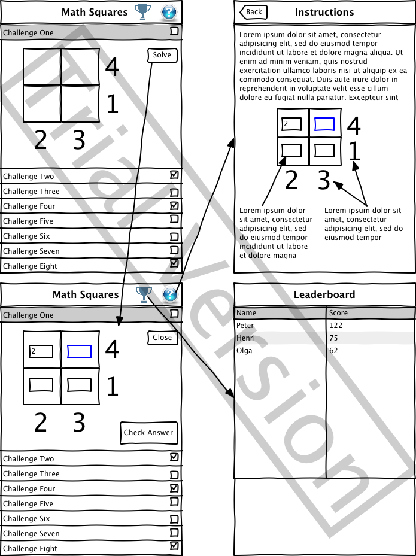

Members: 
  * Dan Dosch
  * Shruthi Ramesh

User Stories:

Optional Login
  - login required for high scores/leaderboard
  - facebook login

Account Creation

Main Activity
  - list view that shows the newest challenges
    - can be re-ordered date
    - can be filtered by whether or not they've completed it
    - new challenges are pulled from server 
  - integrates the Ads SDK
  - pull to refresh to get new challenges from server

Detail Activity (embedded in the list view, the inputs become part of the adapter)
  - Show the challenge
  - Overlay buttons for user to decide which is the correct option

Leaderboard
  - Show a list of who has the best score
  - 
  
Instructions screen
  - Explain how to play (automatically display this screen the first time the user opens the app)

